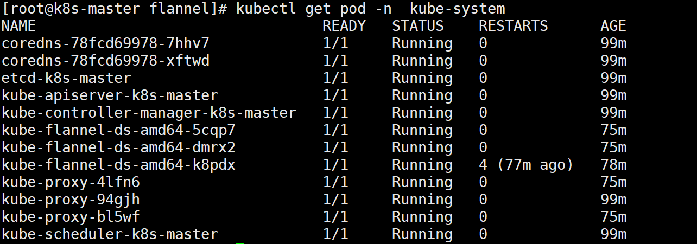

# kubeadm方式部署k8sV1.22.2集群版本

| 操作系统  | 配置    | 地址                        |
| --------- | ------- | --------------------------- |
| Centos7.4 | 4G 2cpu | 192.168.153.148(k8s-master) |
| Centos7.4 | 4G 2cpu | 192.168.153.147(k8s-node1)  |
| Centos7.4 | 4G 2cpu | 192.168.153.196(k8s-node2)  |

 切记要关闭防火墙和selinux，cpu核心数至少为2

## 配置解析

```shell
[root@k8s-master ~]# cat /etc/hosts
127.0.0.1   localhost localhost.localdomain localhost4 localhost4.localdomain4
::1         localhost localhost.localdomain localhost6 localhost6.localdomain6
192.168.153.148 k8s-master
192.168.153.147 k8s-node1
192.168.153.196 k8s-node2
```

## 关闭防火墙和selinux

每个节点都操作

关闭防火墙和selinux,且都设置为开机不启动

```
1.关闭防火墙
# systemctl stop firewalld
# systemctl disable firewalld
2.禁用SELinux：
# setenforce 0
3.编辑文件/etc/selinux/config，将SELINUX修改为disabled，如下：
# sed -i 's/SELINUX=permissive/SELINUX=disabled/' /etc/sysconfig/selinux
SELINUX=disabled
```

## 安装docker应用

每个节点都操作

```
# yum install -y yum-utils device-mapper-persistent-data lvm2 git
# yum-config-manager --add-repo http://mirrors.aliyun.com/docker-ce/linux/centos/docker-ce.repo
# yum install docker-ce -y
启动并设置开机启动
```

## 关闭swap分区

关闭系统Swap：1.5之后的新规定

Kubernetes 1.8开始要求关闭系统的Swap，如果不关闭，默认配置下kubelet将无法启动。方法一,通过kubelet的启动参数–fail-swap-on=false更改这个限制。方法二,关闭系统的Swap。

每个节点都操作

```
# swapoff -a
修改/etc/fstab文件，注释掉SWAP的自动挂载，使用free -m确认swap已经关闭。
2.注释掉swap分区：
[root@localhost /]# sed -i 's/.*swap.*/#&/' /etc/fstab
# free -m
              total        used        free      shared  buff/cache   available
Mem:           3935         144        3415           8         375        3518
Swap:             0           0           0
```

## 拉取docker镜像

说明：其实不拉取也可以，因为初始化的时候，它会自动拉取，但是自动拉取用的是k8s官网的源地址，所以一般我们都会拉取失败，这里我们自己手动拉取aliyun的镜像

请注意：拉取的docker镜像的版本必须要和kubelet、kubectl的版本保持一直

每个节点都操作

这里我直接弄了两个脚本，运行拉取，还要修改镜像的tag；至于为什么要修改为这个版本，这是我后面初始化，看到了报错信息，必须有这个版本的镜像；

这里我们拉去的虽然是aliyun的镜像，但是还是要将tag改为kobeadm能识别到的镜像名字；否则kobeadm初始化的时候，由于镜像名字不对，会识别不到；

```shell
# cat dockerPull.sh
docker pull registry.cn-hangzhou.aliyuncs.com/google_containers/kube-controller-manager:v1.22.2
docker pull registry.cn-hangzhou.aliyuncs.com/google_containers/kube-proxy:v1.22.2
docker pull registry.cn-hangzhou.aliyuncs.com/google_containers/kube-apiserver:v1.22.2
docker pull registry.cn-hangzhou.aliyuncs.com/google_containers/kube-scheduler:v1.22.2
docker pull registry.cn-hangzhou.aliyuncs.com/google_containers/coredns:1.8.4
docker pull registry.cn-hangzhou.aliyuncs.com/google_containers/etcd:3.5.0-0
docker pull registry.cn-hangzhou.aliyuncs.com/google_containers/pause:3.5
```

```shell
# cat dockerTag.sh
docker tag registry.cn-hangzhou.aliyuncs.com/google_containers/kube-controller-manager:v1.22.2 k8s.gcr.io/kube-control
ler-manager:v1.22.2docker tag registry.cn-hangzhou.aliyuncs.com/google_containers/kube-proxy:v1.22.2 k8s.gcr.io/kube-proxy:v1.22.2
docker tag registry.cn-hangzhou.aliyuncs.com/google_containers/kube-apiserver:v1.22.2 k8s.gcr.io/kube-apiserver:v1.22.2
docker tag registry.cn-hangzhou.aliyuncs.com/google_containers/kube-scheduler:v1.22.2 k8s.gcr.io/kube-scheduler:v1.22.2
#docker tag registry.cn-hangzhou.aliyuncs.com/google_containers/coredns:1.8.4 k8s.gcr.io/coredns:1.8.4
docker tag registry.cn-hangzhou.aliyuncs.com/google_containers/coredns:1.8.4 k8s.gcr.io/coredns/coredns:v1.8.4
docker tag registry.cn-hangzhou.aliyuncs.com/google_containers/etcd:3.5.0-0 k8s.gcr.io/etcd:3.5.0-0
docker tag registry.cn-hangzhou.aliyuncs.com/google_containers/pause:3.5 k8s.gcr.io/pause:3.5
```

## 安装kubeadm和kubelet：

所有节点都需要安装

```
配置源
# cat <<EOF > /etc/yum.repos.d/kubernetes.repo
[kubernetes]
name=Kubernetes
baseurl=https://mirrors.aliyun.com/kubernetes/yum/repos/kubernetes-el7-x86_64
enabled=1
gpgcheck=1
repo_gpgcheck=1
gpgkey=https://mirrors.aliyun.com/kubernetes/yum/doc/yum-key.gpg https://mirrors.aliyun.com/kubernetes/yum/doc/rpm-package-key.gpg
EOF
```

```
1.安装
# yum makecache fast
# yum install -y kubelet kubeadm kubectl ipvsadm  #注意，这样默认是下载最新版本v1.22.2
======================================================================
#如果你想下载旧版本，后面要跟上指定的版本号。
[root@k8s-master ~]# yum install -y kubelet-1.17.4-0.x86_64 kubeadm-1.17.4-0.x86_64 kubectl-1.17.4-0.x86_64 ipvsadm

2.加载ipvs相关内核模块
如果重新开机，需要重新加载（可以写在 /etc/rc.local 中开机自动加载）
# modprobe ip_vs
# modprobe ip_vs_rr
# modprobe ip_vs_wrr
# modprobe ip_vs_sh
# modprobe nf_conntrack_ipv4
3.编辑文件添加开机启动
# vim /etc/rc.local
# chmod +x /etc/rc.local

4.配置：
配置转发相关参数，否则可能会出错
# cat <<EOF >  /etc/sysctl.d/k8s.conf
net.bridge.bridge-nf-call-ip6tables = 1
net.bridge.bridge-nf-call-iptables = 1
vm.swappiness=0
EOF

5.使配置生效
# sysctl --system

6.如果net.bridge.bridge-nf-call-iptables报错，加载br_netfilter模块
# modprobe br_netfilter
# sysctl -p /etc/sysctl.d/k8s.conf

7.查看是否加载成功
# lsmod | grep ip_vs
ip_vs_sh               12688  0
ip_vs_wrr              12697  0
ip_vs_rr               12600  0
ip_vs                 141092  6 ip_vs_rr,ip_vs_sh,ip_vs_wrr
nf_conntrack          133387  2 ip_vs,nf_conntrack_ipv4
libcrc32c              12644  3 xfs,ip_vs,nf_conntrack
```


**配置启动kubelet**

所有节点

```
1.配置kubelet使用pause镜像
获取docker的cgroups
# systemctl start docker && systemctl enable docker
# DOCKER_CGROUPS=$(docker info | grep 'Cgroup' | cut -d' ' -f4)
# echo $DOCKER_CGROUPS
=================================
配置变量：
[root@k8s-master ~]# DOCKER_CGROUPS=`docker info |grep 'Cgroup' | awk '{print $3}'`
[root@k8s-master ~]# echo $DOCKER_CGROUPS
cgroupfs

这个是使用国内的源。-###注意我们使用谷歌的镜像--操作下面的第3标题
2.配置kubelet的cgroups
# cat >/etc/sysconfig/kubelet<<EOF
KUBELET_EXTRA_ARGS="--cgroup-driver=$DOCKER_CGROUPS --pod-infra-container-image=registry.cn-hangzhou.aliyuncs.com/google_containers/pause-amd64:3.5"
EOF

3.配置kubelet的cgroups
# cat >/etc/sysconfig/kubelet<<EOF
KUBELET_EXTRA_ARGS="--cgroup-driver=$DOCKER_CGROUPS --pod-infra-container-image=k8s.gcr.io/pause:3.5"
EOF

4.也可以不使用变量，直接写上cgroupfs
# cat >/etc/sysconfig/kubelet<<EOF
KUBELET_EXTRA_ARGS="--cgroup-driver=cgroupfs --pod-infra-container-image=k8s.gcr.io/pause:3.5"
EOF
```

## 启动kubelet

所有节点都操作

```
# systemctl daemon-reload
# systemctl enable kubelet && systemctl restart kubelet
在这里使用 # systemctl status kubelet，你会发现报错误信息；(每个节点都会报错)

10月 11 00:26:43 node1 systemd[1]: kubelet.service: main process exited, code=exited, status=255/n/a
10月 11 00:26:43 node1 systemd[1]: Unit kubelet.service entered failed state.
10月 11 00:26:43 node1 systemd[1]: kubelet.service failed.

运行 # journalctl -xefu kubelet 命令查看systemd日志才发现，真正的错误是：
    unable to load client CA file /etc/kubernetes/pki/ca.crt: open /etc/kubernetes/pki/ca.crt: no such file or directory
#这个错误在运行kubeadm init 生成CA证书后会被自动解决，此处可先忽略。
#简单地说就是在kubeadm init 之前kubelet会不断重启。
```

## 配置master节点初始化

```
运行初始化过程如下：
初始化之前，切记要关闭防火墙和selinux，cpu核心数至少为2
[root@master ～]# kubeadm init --kubernetes-version=v1.22.2 --pod-network-cidr=10.244.0.0/16 --apiserver-advertise-address=192.168.153.148 --ignore-preflight-errors=Swap

注：
apiserver-advertise-address=192.168.153.148    ---master的ip地址。
--kubernetes-version=v1.22.2   --根据具体版本进行修改
注意在检查一下swap分区是否关闭

说明：如果初始化失败，不要慌，注意看它的回显；
```


```
配置使用kubectl
如下操作在master节点操作
[root@kub-k8s-master ~]# rm -rf $HOME/.kube
[root@kub-k8s-master ~]# mkdir -p $HOME/.kube
[root@kub-k8s-master ~]# cp -i /etc/kubernetes/admin.conf $HOME/.kube/config
[root@kub-k8s-master ~]# chown $(id -u):$(id -g) $HOME/.kube/config

查看node节点
[root@k8s-master ~]# kubectl get nodes
NAME         STATUS     ROLES    AGE     VERSION
k8s-master   NotReady   master   2m41s   v1.22.2
```

## 配置flannel网络插件

```
在master节点操作
下载配置
# cd ~ && mkdir flannel && cd flannel
# curl -O https://raw.githubusercontent.com/coreos/flannel/master/Documentation/kube-flannel.yml
修改配置文件kube-flannel.yml:
此处的ip配置要与上面kubeadm的pod-network一致，本来就一致，不用改
  net-conf.json: |
    {
      "Network": "10.244.0.0/16",
      "Backend": {
        "Type": "vxlan"
      }
    }
# 这里注意kube-flannel.yml这个文件里的flannel的镜像是0.11.0，quay.io/coreos/flannel:v0.11.0-amd64
# 默认的镜像是quay.io/coreos/flannel:v0.11.0-amd64，需要提前pull下来。


# 如果Node有多个网卡的话，参考flannel issues 39701，
# https://github.com/kubernetes/kubernetes/issues/39701
# 目前需要在kube-flannel.yml中使用--iface参数指定集群主机内网网卡的名称，
# 否则可能会出现dns无法解析。容器无法通信的情况，需要将kube-flannel.yml下载到本地，
# flanneld启动参数加上--iface=<iface-name>
    containers:
      - name: kube-flannel
        image: quay.io/coreos/flannel:v0.11.0-amd64
        command:
        - /opt/bin/flanneld
        args:
        - --ip-masq
        - --kube-subnet-mgr
        - --iface=ens33
        - --iface=eth0

⚠️⚠️⚠️--iface=ens33 的值，是你当前的网卡,或者可以指定多网卡

# 1.12版本的kubeadm额外给node1节点设置了一个污点(Taint)：node.kubernetes.io/not-ready:NoSchedule，
# 很容易理解，即如果节点还没有ready之前，是不接受调度的。可是如果Kubernetes的网络插件还没有部署的话，节点是不会进入ready状态的。
# 因此修改以下kube-flannel.yaml的内容，加入对node.kubernetes.io/not-ready:NoSchedule这个污点的容忍：
    - key: beta.kubernetes.io/arch
                    operator: In
                    values:
                      - arm64
      hostNetwork: true
      tolerations:
      - operator: Exists
        effect: NoSchedule
      - key: node.kubernetes.io/not-ready  #添加如下三行---在261行左右
        operator: Exists
        effect: NoSchedule
      serviceAccountName: flannel
```


上面的这个镜像，是解决网络问题的flannel镜像，每个节点都要拉取

```
# docker pull quay.io/coreos/flannel:v0.12.0-arm64 #其实，它也会自动拉取。
```


```
启动：
[root@k8s-master flannel]# kubectl apply -f kube-flannel.yml  #启动完成之后需要等待一会
查看文件中，指定的api对象，是否都创建成功
[root@k8s-master flannel]# kubectl get pod -n  kube-system
```



如果有pod信息异常，一直不成功，可以单独删除这个pod，它会自动生成最新的

```
查看：
# kubectl get pods --namespace kube-system
# kubectl get service
# kubectl get svc --namespace kube-system
只有网络插件也安装配置完成之后，才能会显示为ready状态
```

## 所有node节点加入k8s集群

```
配置node节点加入集群：
如果报错开启ip转发：
# sysctl -w net.ipv4.ip_forward=1
在所有node节点操作，此命令为初始化master成功后返回的结果
[root@k8s-node1 ~]# kubeadm join 192.168.153.148:6443 --token i55tp0.2pbex252ygp6lkcl \
> --discovery-token-ca-cert-hash sha256:88036a8f40bfe92538d17e5f6c89c9567ba25ec7940c5b70030f8f676c9a051c
[root@k8s-node2 ~]# sysctl -w net.ipv4.ip_forward=1
net.ipv4.ip_forward = 1
[root@k8s-node2 ~]# kubeadm join 192.168.153.148:6443 --token i55tp0.2pbex252ygp6lkcl \
> --discovery-token-ca-cert-hash sha256:88036a8f40bfe92538d17e5f6c89c9567ba25ec7940c5b70030f8f676c9a051c
```


## 在master操作：

```
[root@k8s-master flannel]# kubectl get nodes
NAME         STATUS   ROLES                  AGE    VERSION
k8s-master   Ready    control-plane,master   102m   v1.22.2
k8s-node1    Ready    <none>                 77m    v1.22.2
k8s-node2    Ready    <none>                 77m    v1.22.2

```

## 错误整理

```
错误
问题1：服务器时间不一致会报错
查看服务器时间
=====================================
问题2：kubeadm init不成功,发现如下提示，然后超时报错
[wait-control-plane] Waiting for the kubelet to boot up the control plane as static Pods from directory "/etc/kubernetes/manifests". This can take up to 4m0s

查看kubelet状态发现如下错误，主机master找不到和镜像下载失败，发现pause镜像是从aliyuncs下载的，其实我已经下载好了官方的pause镜像，按着提示的镜像名称重新给pause镜像打个ali的tag，最后重置kubeadm的环境重新初始化，错误解决
[root@master manifests]# systemctl  status kubelet -l
● kubelet.service - kubelet: The Kubernetes Node Agent
   Loaded: loaded (/etc/systemd/system/kubelet.service; enabled; vendor preset: disabled)
  Drop-In: /etc/systemd/system/kubelet.service.d
           └─10-kubeadm.conf
   Active: active (running) since 四 2019-01-31 15:20:32 CST; 5min ago
     Docs: https://kubernetes.io/docs/
 Main PID: 23908 (kubelet)
    Tasks: 19
   Memory: 30.8M
   CGroup: /system.slice/kubelet.service
           └─23908 /usr/bin/kubelet --bootstrap-kubeconfig=/etc/kubernetes/bootstrap-kubelet.conf --kubeconfig=/etc/kubernetes/kubelet.conf --config=/var/lib/kubelet/config.yaml --cgroup-driver=cgroupfs --network-plugin=cni --pod-infra-container-image=k8s.gcr.io/pause:3.1 --cgroup-driver=cgroupfs --pod-infra-container-image=registry.cn-hangzhou.aliyuncs.com/google_containers/pause-amd64:3.1

1月 31 15:25:41 master kubelet[23908]: E0131 15:25:41.432357   23908 kubelet.go:2266] node "master" not found
1月 31 15:25:41 master kubelet[23908]: E0131 15:25:41.532928   23908 kubelet.go:2266] node "master" not found
1月 31 15:25:41 master kubelet[23908]: E0131 15:25:41.633192   23908 kubelet.go:2266] node "master" not found
1月 31 15:25:41 master kubelet[23908]: I0131 15:25:41.729296   23908 kubelet_node_status.go:278] Setting node annotation to enable volume controller attach/detach
1月 31 15:25:41 master kubelet[23908]: E0131 15:25:41.733396   23908 kubelet.go:2266] node "master" not found
1月 31 15:25:41 master kubelet[23908]: E0131 15:25:41.740110   23908 remote_runtime.go:96] RunPodSandbox from runtime service failed: rpc error: code = Unknown desc = failed pulling image "registry.cn-hangzhou.aliyuncs.com/google_containers/pause-amd64:3.1": Error response from daemon: Get https://registry.cn-hangzhou.aliyuncs.com/v2/: dial tcp 0.0.0.80:443: connect: invalid argument
1月 31 15:25:41 master kubelet[23908]: E0131 15:25:41.740153   23908 kuberuntime_sandbox.go:68] CreatePodSandbox for pod "kube-controller-manager-master_kube-system(e8f43404e60ae844e375d50b1e39d91e)" failed: rpc error: code = Unknown desc = failed pulling image "registry.cn-hangzhou.aliyuncs.com/google_containers/pause-amd64:3.1": Error response from daemon: Get https://registry.cn-hangzhou.aliyuncs.com/v2/: dial tcp 0.0.0.80:443: connect: invalid argument
1月 31 15:25:41 master kubelet[23908]: E0131 15:25:41.740166   23908 kuberuntime_manager.go:662] createPodSandbox for pod "kube-controller-manager-master_kube-system(e8f43404e60ae844e375d50b1e39d91e)" failed: rpc error: code = Unknown desc = failed pulling image "registry.cn-hangzhou.aliyuncs.com/google_containers/pause-amd64:3.1": Error response from daemon: Get https://registry.cn-hangzhou.aliyuncs.com/v2/: dial tcp 0.0.0.80:443: connect: invalid argument
1月 31 15:25:41 master kubelet[23908]: E0131 15:25:41.740207   23908 pod_workers.go:190] Error syncing pod e8f43404e60ae844e375d50b1e39d91e ("kube-controller-manager-master_kube-system(e8f43404e60ae844e375d50b1e39d91e)"), skipping: failed to "CreatePodSandbox" for "kube-controller-manager-master_kube-system(e8f43404e60ae844e375d50b1e39d91e)" with CreatePodSandboxError: "CreatePodSandbox for pod \"kube-controller-manager-master_kube-system(e8f43404e60ae844e375d50b1e39d91e)\" failed: rpc error: code = Unknown desc = failed pulling image \"registry.cn-hangzhou.aliyuncs.com/google_containers/pause-amd64:3.1\": Error response from daemon: Get https://registry.cn-hangzhou.aliyuncs.com/v2/: dial tcp 0.0.0.80:443: connect: invalid argument"
1月 31 15:25:41 master kubelet[23908]: E0131 15:25:41.833981   23908 kubelet.go:2266] node "master" not found
```

## 解决方式

```
重置kubeadm环境
整个集群所有节点(包括master)重置/移除节点
1.驱离k8s-node-1节点上的pod（master上）
[root@kub-k8s-master ~]# kubectl drain kub-k8s-node1 --delete-local-data --force --ignore-daemonsets

2.删除节点（master上）
[root@kub-k8s-master ~]# kubectl delete node kub-k8s-node1

3.重置节点(node上-也就是在被删除的节点上)
[root@kub-k8s-node1 ~]# kubeadm reset

注1：需要把master也驱离、删除、重置，这里给我坑死了，第一次没有驱离和删除master，最后的结果是查看结果一切正常，但coredns死活不能用，搞了整整1天，切勿尝试

注2：master上在reset之后需要删除如下文件
# rm -rf /var/lib/cni/ $HOME/.kube/config

###注意：如果整个k8s集群都做完了，需要重置按照上面步骤操作。如果是在初始化出错只需要操作第三步
```

## 重新生成token

```
kubeadm 生成的token过期后，集群增加节点

通过kubeadm初始化后，都会提供node加入的token:
You should now deploy a pod network to the cluster.
Run "kubectl apply -f [podnetwork].yaml" with one of the options listed at:
  https://kubernetes.io/docs/concepts/cluster-administration/addons/

You can now join any number of machines by running the following on each node
as root:

  kubeadm join 192.168.246.166:6443 --token n38l80.y2icehgzsyuzkthi \
    --discovery-token-ca-cert-hash sha256:5fb6576ef82b5655dee285e0c93432aee54d38779bc8488c32f5cbbb90874bac
默认token的有效期为24小时，当过期之后，该token就不可用了。

~~~~~~~~~~~~~~~~~~~~~~~~~~~~~~~~~

解决方法：
1. 重新生成新的token:
[root@node1 flannel]# kubeadm  token create
kiyfhw.xiacqbch8o8fa8qj
[root@node1 flannel]# kubeadm  token list
TOKEN                     TTL         EXPIRES                     USAGES                   DESCRIPTION   EXTRA GROUPS
gvvqwk.hn56nlsgsv11mik6   <invalid>   2018-10-25T14:16:06+08:00   authentication,signing   <none>        system:bootstrappers:kubeadm:default-node-token
kiyfhw.xiacqbch8o8fa8qj   23h         2018-10-27T06:39:24+08:00   authentication,signing   <none>        system:bootstrappers:kubeadm:default-node-token

2. 获取ca证书sha256编码hash值:
[root@node1 flannel]# openssl x509 -pubkey -in /etc/kubernetes/pki/ca.crt | openssl rsa -pubin -outform der 2>/dev/null | openssl dgst -sha256 -hex | sed 's/^.* //'
5417eb1b68bd4e7a4c82aded83abc55ec91bd601e45734d6aba85de8b1ebb057

3. 节点加入集群:
  kubeadm join 18.16.202.35:6443 --token kiyfhw.xiacqbch8o8fa8qj --discovery-token-ca-cert-hash sha256:5417eb1b68bd4e7a4c82aded83abc55ec91bd601e45734d6aba85de8b1ebb057
几秒钟后，您应该注意到kubectl get nodes在主服务器上运行时输出中的此节点。

上面的方法比较繁琐，一步到位：
kubeadm token create --print-join-command

第二种方法：
token=$(kubeadm token generate)
kubeadm token create $token --print-join-command --ttl=0
```

# kubeadm方式部署k8sV1.18.1集群版本

所需镜像：

```
[root@k8s-master ~]# cat dockpullImages1.18.1.sh
#!/bin/bash
##所需要的镜像名字
#k8s.gcr.io/kube-apiserver:v1.18.1
#k8s.gcr.io/kube-controller-manager:v1.18.1
#k8s.gcr.io/kube-scheduler:v1.18.1
#k8s.gcr.io/kube-proxy:v1.18.1
#k8s.gcr.io/pause:3.2
#k8s.gcr.io/etcd:3.4.3-0
#k8s.gcr.io/coredns:1.6.7
###拉取镜像
docker pull registry.cn-hangzhou.aliyuncs.com/google_containers/kube-apiserver:v1.18.1
docker pull registry.cn-hangzhou.aliyuncs.com/google_containers/kube-controller-manager:v1.18.1
docker pull registry.cn-hangzhou.aliyuncs.com/google_containers/kube-scheduler:v1.18.1
docker pull registry.cn-hangzhou.aliyuncs.com/google_containers/kube-proxy:v1.18.1
docker pull registry.cn-hangzhou.aliyuncs.com/google_containers/pause:3.2
docker pull registry.cn-hangzhou.aliyuncs.com/google_containers/etcd:3.4.3-0
docker pull registry.cn-hangzhou.aliyuncs.com/google_containers/coredns:1.6.7
###修改tag
docker tag registry.cn-hangzhou.aliyuncs.com/google_containers/kube-apiserver:v1.18.1 k8s.gcr.io/kube-apiserver:v1.18.1
docker tag registry.cn-hangzhou.aliyuncs.com/google_containers/kube-controller-manager:v1.18.1 k8s.gcr.io/kube-controller-manager:v1.18.1
docker tag registry.cn-hangzhou.aliyuncs.com/google_containers/kube-scheduler:v1.18.1 k8s.gcr.io/kube-scheduler:v1.18.1
docker tag registry.cn-hangzhou.aliyuncs.com/google_containers/kube-proxy:v1.18.1 k8s.gcr.io/kube-proxy:v1.18.1
docker tag registry.cn-hangzhou.aliyuncs.com/google_containers/pause:3.2 k8s.gcr.io/pause:3.2
docker tag registry.cn-hangzhou.aliyuncs.com/google_containers/etcd:3.4.3-0 k8s.gcr.io/etcd:3.4.3-0
docker tag registry.cn-hangzhou.aliyuncs.com/google_containers/coredns:1.6.7 k8s.gcr.io/coredns:1.6.7
```

安装pod网络插件

```
[root@k8s-master ~]# wget https://raw.githubusercontent.com/coreos/flannel/master/Documentation/kube-flannel.yml
[root@k8s-master ~]# kubectl apply -f kube-flannel.yml
```

确保都是running,我是这是做完了之后截的图，只到这一步的话，没有这么多pod


然后2个node节点加入集群

```
# kubeadm join 172.16.2.103:6443 --token jvjxs2.xu92rq4fetgtpy1o \
>     --discovery-token-ca-cert-hash sha256:56159a0de43781fd57f1df829de4fe906cf355f4fec8ff7f6f9078c77c8c292d
```

## 1.移除node节点的方法

```
[root@k8s-master ~]# kubectl drain k8s-node2 --delete-local-data --force --ignore-daemonsets
```


```
[root@k8s-master ~]# kubectl delete nodes k8s-node2
node "k8s-node2" deleted
[root@k8s-master ~]# kubectl get nodes
NAME         STATUS   ROLES    AGE     VERSION
k8s-master   Ready    master   11m     v1.18.1
k8s-node1    Ready    <none>   7m39s   v1.18.1   #node2节点已经移除
```

## 2.添加已删除节点

前提：token未失效

如果这个时候再想添加进来这个node，需要执行两步操作

第一步：停掉kubelet(需要添加进来的节点操作)

```
[root@k8s-node2 ~]# systemctl stop kubelet
```

第二步：删除相关文件

```
[root@k8s-node2 ~]# rm -rf /etc/kubernetes/*
```

第三步：添加节点

```
因为之前的token还有效，我这里并没有超出token的有效期；直接执行加入集群的命令即可；
[root@k8s-node2 ~]# kubeadm join 172.16.2.103:6443 --token jvjxs2.xu92rq4fetgtpy1o     --discovery-token-ca-cert-hash sha256:56159a0de43781fd57f1df829de4fe906cf355f4fec8ff7f6f9078c77c8c292d
```

第四步：验证查看


## 3.忘掉token再次添加进k8s集群

前提：token未失效

第一步：主节点执行命令

在主控节点，获取token：


第二步： 获取ca证书sha256编码hash值

在主控节点

```
[root@k8s-master ~]#  openssl x509 -pubkey -in /etc/kubernetes/pki/ca.crt | openssl rsa -pubin -outform der 2>/dev/null | openssl dgst -sha256 -hex | sed 's/^.* //'
56159a0de43781fd57f1df829de4fe906cf355f4fec8ff7f6f9078c77c8c292d
```


第三步：主节点移除node2

```
[root@k8s-master ~]# kubectl drain k8s-node2 --delete-local-data --force --ignore-daemonsets
[root@k8s-master ~]# kubectl delete nodes k8s-node2
[root@k8s-master ~]# kubectl get node
```


第四步：从节点执行如下的命令

```
[root@k8s-node2 ~]# systemctl stop kubelet
[root@k8s-node2 ~]# rm -rf /etc/kubernetes/*
```

第五步：加入集群

指定主节点IP，端口是6443

在生成的证书前有sha256:

```
[root@k8s-node2 ~]# kubeadm join 172.16.2.103:6443 --token jvjxs2.xu92rq4fetgtpy1o     --discovery-token-ca-cert-hash sha256:56159a0de43781fd57f1df829de4fe906cf355f4fec8ff7f6f9078c77c8c292d
```

第六步：主节点查看验证


