# 一、Helm是什么

没有使用Helm之前，在Kubernetes部署应用，我们要依次部署deployment、service等，步骤比较繁琐。况且随着很多项目微服务化，复杂的应用在容器中部署以及管理显得较为复杂。

helm通过打包的方式，支持发布的版本管理和控制，很大程度上简化了Kubernetes应用的部署和管理。

Helm本质就是让k8s的应用管理（Deployment、Service等）可配置，能动态生成。通过动态生成K8S资源清单文件（deployment.yaml、service.yaml）。然后kubectl自动调用K8S资源部署。

Helm是官方提供类似于YUM的包管理，是部署环境的流程封装，Helm有三个重要的概念：chart、release和Repository

chart是创建一个应用的信息集合，包括各种Kubernetes对象的配置模板、参数定义、依赖关系、文档说明等。可以将chart想象成apt、yum中的软件安装包。
release是chart的运行实例，代表一个正在运行的应用。当chart被安装到Kubernetes集群，就生成一个release。chart能多次安装到同一个集群，每次安装都是一个release【根据chart赋值不同，完全可以部署出多个release出来】。
Repository用于发布和存储 Chart 的存储库。

Helm包含两个组件：Helm客户端和Tiller服务端，如下图所示：


Helm 客户端负责 chart 和 release 的创建和管理以及和 Tiller 的交互。Tiller 服务端运行在 Kubernetes 集群中，它会处理Helm客户端的请求，与 Kubernetes API Server 交互。

## HelmV2.0部署

现在越来越多的公司和团队开始使用Helm这个Kubernetes的包管理器，我们也会使用Helm安装Kubernetes的常用组件。Helm由客户端命令helm工具和服务端tiller组成。

helm的GitHub地址

```
https://github.com/helm/helm
```

本次部署版本


现在的版本，已经更新了，这东西更新特别快；

### Helm安装部署

```shell
[root@k8s-master software]# pwd
/root/software 
[root@k8s-master software]# wget https://get.helm.sh/helm-v2.16.9-linux-amd64.tar.gz 
[root@k8s-master software]# 
[root@k8s-master software]# tar xf helm-v2.16.9-linux-amd64.tar.gz
[root@k8s-master software]# ll
total 12624
-rw-r--r-- 1 root root 12926032 Jun 16 06:55 helm-v3.2.4-linux-amd64.tar.gz
drwxr-xr-x 2 3434 3434       50 Jun 16 06:55 linux-amd64
[root@k8s-master software]# 
[root@k8s-master software]# cp -a linux-amd64/helm /usr/bin/helm
```

因为Kubernetes API Server开启了RBAC访问控制，所以需要创建tiller的service account:tiller并分配合适的角色给它。这里为了简单起见我们直接分配cluster-admin这个集群内置的ClusterRole给它。

```shell
[root@k8s-master helm]# pwd
/root/k8s_practice/helm
[root@k8s-master helm]# 
[root@k8s-master helm]# cat rbac-helm.yaml
apiVersion: v1
kind: ServiceAccount
metadata:
  name: tiller
  namespace: kube-system
---
apiVersion: rbac.authorization.k8s.io/v1
kind: ClusterRoleBinding
metadata:
  name: tiller
roleRef:
  apiGroup: rbac.authorization.k8s.io
  kind: ClusterRole
  name: cluster-admin
subjects:
- kind: ServiceAccount
  name: tiller
  namespace: kube-system
[root@k8s-master helm]# 
[root@k8s-master helm]# kubectl apply -f rbac-helm.yaml 
serviceaccount/tiller created
clusterrolebinding.rbac.authorization.k8s.io/tiller created
```

初始化Helm的client 和 server

```shell
[root@k8s-master helm]# helm init --service-account tiller
………………
[root@k8s-master helm]# kubectl get pod -n kube-system -o wide | grep 'tiller'
tiller-deploy-8488d98b4c-j8txs       0/1     Pending   0          38m     <none>         <none>

查看pod的详细信息，发现是镜像拉取失败，因为他默认拉取的是国外的goole镜像，需要翻墙，我这里没有翻墙
[root@k8s-master helm]# kubectl describe pod tiller-deploy-8488d98b4c-j8txs -n kube-system
```

因此这里需要修改镜像地址，采用更新命令即可

```shell
[root@k8s-master helm]# helm init --upgrade --tiller-image registry.cn-beijing.aliyuncs.com/google_registry/tiller:v2.16.9
[root@k8s-master helm]# 
### 等待一会儿后
[root@k8s-master helm]# kubectl get pod -o wide -A | grep 'till'
kube-system    tiller-deploy-7b7787d77-zln6t    1/1     Running   0    8m43s   10.244.4.123   k8s-node01   <none>    <none>
```

如果更新命令执行失败，进行下面操作

我们在上面，发现只要安装tiller，它就会自动生成1个deployment


所以，我们直接去改这个deployment的镜像

```
[root@k8s-master efk]# kubectl edit deploy tiller-deploy -n kube-system
```


改完之后，它会自动加载，等待一会

```shell
[root@k8s-master efk]# kubectl get pod -n kube-system
```


```
[root@k8s-master efk]# helm version
Client: &version.Version{SemVer:"v2.16.9", GitCommit:"8ad7037828e5a0fca1009dabe290130da6368e39", GitTreeState:"
clean"}Server: &version.Version{SemVer:"v2.16.9", GitCommit:"8ad7037828e5a0fca1009dabe290130da6368e39", GitTreeState:"
dirty"}
```

# Helm使用

## helm源地址

helm默认使用的charts源地址

```shell
[root@k8s-master templates]# helm repo list
NAME  	URL                                            
local 	http://127.0.0.1:8879/charts                   
stable	https://kubernetes-charts.storage.googleapis.com
```

改变helm源【是否改变helm源，根据实际情况而定，一般不需要修改】

```shell
helm repo remove stable
helm repo add stable https://kubernetes.oss-cn-hangzhou.aliyuncs.com/charts
helm repo add stable https://burdenbear.github.io/kube-charts-mirror  #我用的是这个，网友开源的
helm repo update
helm repo list
```


## HelmV3.0部署


Helm V3 与 V2 最大的区别在于去掉了tiller：


# 二、Helm安装

安装包的下载地址：`https://github.com/helm/helm/releases`，最新版本3.7.0.

下载软件包：`helm-v3.7.0-linux-amd64.tar.gz`


```shell
[root@k8s-master ~]# wget https://get.helm.sh/helm-v3.7.0-linux-amd64.tar.gz
[root@k8s-master ~]# tar xf helm-v3.7.0-linux-amd64.tar.gz
[root@k8s-master ~]# cp linux-amd64/helm /usr/bin/helm
```

helm部署完成。可以见得部署，版本v3比v2方便很多

# 三、Helm仓库的使用

搜索官方helm hub chart库：

```shell
[root@k8s-master ~]# helm search hub redis
```


Helm 添加第三方 Chart 库：

```shell
helm V3.0以上，是没有默认源的，需要自己添加
[root@k8s-master ~]#  helm repo add stable https://burdenbear.github.io/kube-charts-mirror
"stable" has been added to your repositories
# 这里是在网上找的1个源，暂时还挺好使
如果源不好用，在这个网址，去找可用的源即可。都是百度找的。https://www.guojingyi.cn/899.html
```


```shell
[root@k8s-master ~]# helm search repo redis
```


#### 改变helm源

```shell
【是否改变helm源，根据实际情况而定，一般不需要修改】

[root@k8s-master ~]# helm repo remove stable
"stable" has been removed from your repositories
[root@k8s-master ~]# helm repo list
Error: no repositories to show

[root@k8s-master ~]# helm repo add stable https://kubernetes.oss-cn-hangzhou.aliyuncs.com/charts
[root@k8s-master ~]# helm repo update     #更新源
[root@k8s-master ~]# helm repo list       #列出源地址   
```

#### helm常见应用操作

```shell
列出charts仓库中所有可用的应用
helm search repo

查询指定应用
helm search repo memcached

用helm安装软件包,--name:指定release名字
helm install  memcached1 stable/memcached

查看安装的软件包
helm list

删除指定引用
helm delete memcached1
```

#### helm常用命令

**chart管理**

```
create：根据给定的name创建一个新chart
fetch：从仓库下载chart，并(可选项)将其解压缩到本地目录中
inspect：chart详情
package：打包chart目录到一个chart归档
lint：语法检测
verify：验证位于给定路径的chart已被签名且有效
```

上述操作可结合下文示例，这样能看到更多细节。

### helm示例

**chart文件信息**

```shell
[root@k8s-master my-test-app]# pwd
/root/helm/my-test-app
[root@k8s-master my-test-app]# cat Chart.yaml 
apiVersion: v1
appVersion: v2.2
description: my test app
keywords:
- myapp
maintainers:
- email: zhang@test.com
  name: zhang
# 该name值与上级目录名相同
name: my-test-app
version: v1.0.0

[root@k8s-master my-test-app]# cat values.yaml 
deployname: my-test-app02
replicaCount: 2
images:
  repository: httpd
  tag: latest
  
[root@k8s-master my-test-app]# ll templates/
总用量 8
-rw-r--r--. 1 root root 543 9月  24 09:27 deployment.yaml

[root@k8s-master my-test-app]# cat templates/deployment.yaml 
apiVersion: apps/v1
kind: Deployment
metadata:
  name: {{ .Values.deployname }}
  labels:
    app: mytestapp-deploy
spec:
  replicas: {{ .Values.replicaCount }}
  selector:
    matchLabels:
      app: mytestapp
      env: test
  template:
    metadata:
      labels:
        app: mytestapp
        env: test
        description: mytest
    spec:
      containers:
      - name: myapp-pod
        image: {{ .Values.images.repository }}:{{ .Values.images.tag }}
        imagePullPolicy: IfNotPresent
        ports:
          - containerPort: 80
          
[root@k8s-master my-test-app]# cat templates/service.yaml 
apiVersion: v1
kind: Service
metadata:
  name: my-test-app
  namespace: default
spec:
  type: NodePort
  selector:
    app: mytestapp
    env: test
  ports:
  - name: http
    port: 80
    targetPort: 80
    protocol: TCP
```

### 生成release

```
[root@k8s-master my-test-app]# ll
总用量 8
-rw-r--r--. 1 root root 197 9月  24 09:26 Chart.yaml
drwxr-xr-x. 2 root root  49 9月  24 09:28 templates
-rw-r--r--. 1 root root  84 9月  24 09:30 values.yaml

[root@k8s-master my-test-app]# helm install mytest-app01 .
```


```
[root@k8s-master my-test-app]# kubectl get pod -o wide
NAME                             READY   STATUS    RESTARTS   AGE     IP           NODE        NOMINATED NODE   READINESS GATES
my-test-app02-789dd8465c-9mk8k   1/1     Running   0          7m22s   10.244.1.4   k8s-node1   <none>           <none>
my-test-app02-789dd8465c-fvcs7   1/1     Running   0          7m22s   10.244.2.4   k8s-node2   <none>           <none>

[root@k8s-master my-test-app]# kubectl get svc
NAME          TYPE        CLUSTER-IP       EXTERNAL-IP   PORT(S)        AGE
kubernetes    ClusterIP   10.96.0.1        <none>        443/TCP        13h
my-test-app   NodePort    10.109.118.121   <none>        80:31289/TCP   7m25s
```

访问测试：

都能访问到


### chart更新

values.yaml文件修改

```
[root@k8s-master my-test-app]# cat values.yaml
```


这个镜像，实在daocloud上随便找的


```shell
[root@k8s-master my-test-app]# helm upgrade mytest-app01 .   #更新
### 如果在上级目录则为 helm upgrade mytest-app01 my-test-app/
```


再次查看pod


等待一会儿。。。。


```shell
[root@k8s-master my-test-app]# helm list  #可以看到更新成功
```


# 四、Helm V3.7.0+K8S V1.22.2实战项目EFK

Helm用于k8s集群安装EFK日志平台

| 操作系统  | 配置    | 地址                        |
| --------- | ------- | --------------------------- |
| Centos7.4 | 4G 2cpu | 192.168.153.148(k8s-master) |
| Centos7.4 | 4G 2cpu | 192.168.153.147(k8s-node1)  |
| Centos7.4 | 4G 2cpu | 192.168.153.196(k8s-node2)  |

 切记要关闭防火墙和selinux，cpu核心数至少为2

EFK由ElasticSearch、Fluentd和Kiabana三个开源工具组成。其中Elasticsearch是一款分布式搜索引擎，能够用于日志的检索，Fluentd是一个实时开源的数据收集器,而Kibana 是一款能够为Elasticsearch 提供分析和可视化的 Web 平台。这三款开源工具的组合为日志数据提供了分布式的实时搜集与分析的监控系统。

而在此之前，业界是采用ELK(Elasticsearch + Logstash + Kibana)来管理日志。Logstash是一个具有实时渠道能力的数据收集引擎,但和fluentd相比，它在效能上表现略逊一筹，性能较差，JVM容易导致内存使用量高，故而逐渐被fluentd取代，ELK也随之变成EFK。

Fluentd是一个开源的数据收集器，专为处理数据流设计，使用JSON作为数据格式。它采用了插件式的架构，具有高可扩展性高可用性，同时还实现了高可靠的信息转发；

当然，现在用logstash、filebeat的公司较多、fluentd的较少一些; 不过这个软件确实非常好用；我也在慢慢研究；

## 1.EFK镜像下载

由于镜像都在国外，因此我们在国内下载镜像，然后tag为对应的镜像名称。执行如下脚本【集群所有机器都执行】：

所有节点都操作：

```shell
[root@k8s-master ~]# vim download_efk_image.sh
#!/bin/sh

##### 在 master 节点和 worker 节点都要执行 【所有机器执行】

# 加载环境变量
. /etc/profile
. /etc/bashrc

# 变量设置
elasticsearch_iamge="elasticsearch-oss:6.7.0"
busybox_image="busybox:latest"
bats_image="bats:0.4.0"
fluentd_image="fluentd-elasticsearch:v2.3.2"
kibana_image="kibana-oss:6.7.0"

# 集群所有机器执行
# elasticsearch镜像下载
docker pull registry.cn-beijing.aliyuncs.com/google_registry/${elasticsearch_iamge}
docker tag  registry.cn-beijing.aliyuncs.com/google_registry/${elasticsearch_iamge} docker.elastic.co/elasticsearch/${elasticsearch_iamge}
docker rmi  registry.cn-beijing.aliyuncs.com/google_registry/${elasticsearch_iamge}
# busybox镜像下载
docker pull registry.cn-beijing.aliyuncs.com/google_registry/${busybox_image}
docker tag  registry.cn-beijing.aliyuncs.com/google_registry/${busybox_image} ${busybox_image}
docker rmi  registry.cn-beijing.aliyuncs.com/google_registry/${busybox_image}
# bats镜像下载
docker pull registry.cn-beijing.aliyuncs.com/google_registry/${bats_image}
docker tag  registry.cn-beijing.aliyuncs.com/google_registry/${bats_image} dduportal/${bats_image}
docker rmi  registry.cn-beijing.aliyuncs.com/google_registry/${bats_image}
# fluentd-elasticsearch镜像下载
docker pull registry.cn-beijing.aliyuncs.com/google_registry/${fluentd_image}
docker tag  registry.cn-beijing.aliyuncs.com/google_registry/${fluentd_image} gcr.io/google-containers/${fluentd_image}
docker rmi  registry.cn-beijing.aliyuncs.com/google_registry/${fluentd_image}
# kibana-oss镜像下载
docker pull registry.cn-beijing.aliyuncs.com/google_registry/${kibana_image}
docker tag  registry.cn-beijing.aliyuncs.com/google_registry/${kibana_image} docker.elastic.co/kibana/${kibana_image}
docker rmi  registry.cn-beijing.aliyuncs.com/google_registry/${kibana_image}

[root@k8s-master ~]# chmod +x download_efk_image.sh 
[root@k8s-master ~]# ./download_efk_image.sh
```

## 2.Elasticsearch部署

本次部署EFK，创建一个efk名称空间。

```
# 创建 efk 名称空间
[root@k8s-master ~]# kubectl create namespace efk
namespace/efk created
[root@k8s-master ~]# kubectl get ns
```

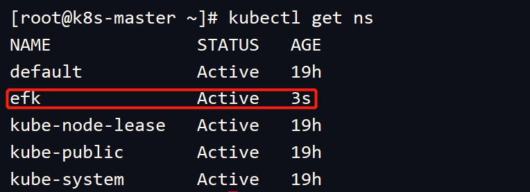

## 3.chart下载与配置修改

```
# 当前目录
[root@k8s-master efk]# pwd
/root/k8s_practice/efk
# ES版本查看，本次我们部署chart 1.30.0版本，ES 6.7.0版本

#先看下这里使用的helm的源，后续的下载，我都使用的此源，暂时可用；
[root@k8s-master efk]# helm repo list
NAME    URL                                            
stable  https://burdenbear.github.io/kube-charts-mirror

[root@k8s-master efk]# helm search repo stable/elasticsearch
```

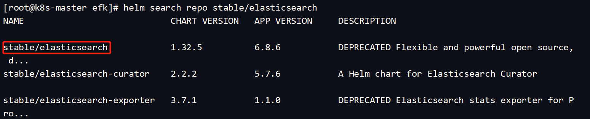

```shell
[root@k8s-master efk]# helm fetch stable/elasticsearch --version 1.30.0
[root@k8s-master efk]# ls
elasticsearch-1.30.0.tgz
[root@k8s-master efk]# tar xzf elasticsearch-1.30.0.tgz
# 修改配置文件1
[root@k8s-master efk]# vim elasticsearch/values.yaml
initImage:
  repository: "busybox"
  tag: "latest"
  pullPolicy: "IfNotPresent" #将Always改为IfNotPresent，保证它不会一直拉取最新镜像
==================================
client:
  name: client
  replicas: 1
  serviceType: ClusterIP # 从2改为1，因为是在自己PC机操作的，内存有限
===================================
master:
  name: master
  exposeHttp: false
  replicas: 3
  heapSize: "512m"
  # additionalJavaOpts: "-XX:MaxRAM=512m"
  persistence:
    enabled: false  # 没有多余的PVC，因此从true改为false
    accessMode: ReadWriteOnce
    name: data
===================================
data:
  name: data
  exposeHttp: false
  replicas: 1 # 从2改为1，因为是在自己PC机操作的，内存有限
  heapSize: "1024m" # 从1536m改为1024m，因为是在自己PC机操作的，内存有限
  # additionalJavaOpts: "-XX:MaxRAM=1536m"
  persistence:
    enabled: false # 没有多余的PVC，因此从true改为false
    accessMode: ReadWriteOnce
    name: data
    
# 修改配置文件2   
[root@k8s-master efk]# vim elasticsearch/templates/client-deployment.yaml
apiVersion: apps/v1  # 从 apps/v1beta1 改为 apps/v1
kind: Deployment
===================================
```

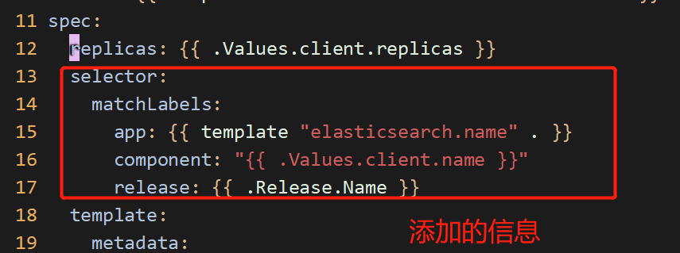

```
# 修改配置文件3
[root@k8s-master efk]# vim elasticsearch/templates/data-statefulset.yaml
apiVersion: apps/v1
kind: StatefulSet
===================================
```

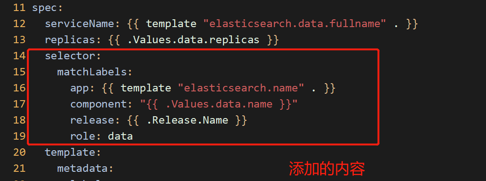

```
# 修改配置文件4
[root@k8s-master efk]# vim elasticsearch/templates/master-statefulset.yaml
apiVersion: apps/v1
kind: StatefulSet
===================================
```

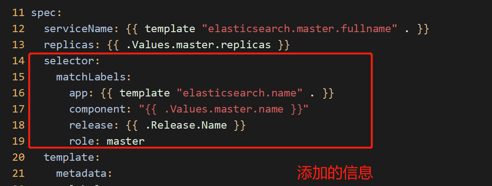

## 4.Elasticsearch部署

步骤如下：

```
# 当前目录
[root@k8s-master efk]# pwd
/root/k8s_practice/efk

# 部署ES
[root@k8s-master efk]# helm install es01 --namespace=efk elasticsearch
```

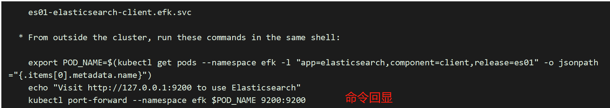

```
[root@k8s-master efk]# helm list -n efk
```

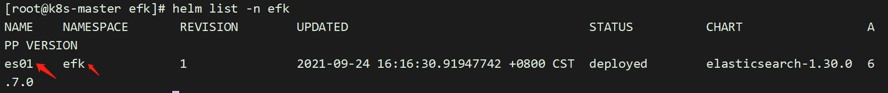

```
[root@k8s-master efk]# kubectl get deploy -n efk
```

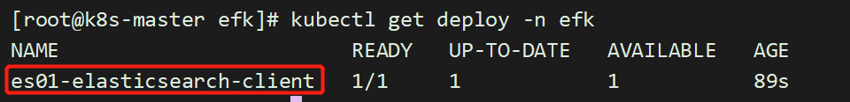

```
[root@k8s-master efk]# kubectl get pods -n efk
```

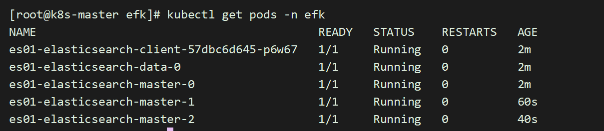

```
[root@k8s-master efk]# kubectl get service -n efk
```

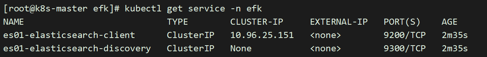

```
[root@k8s-master efk]# kubectl get statefulsets -n efk
```

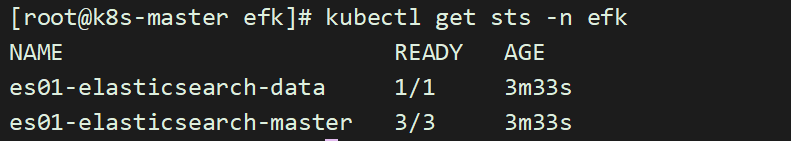

ES以statefulset的类型部署，主要是它会有1个唯一不变的域名标识，后面kibana和fluentd只需要配置这个域名标识就可以了；

## 5.Elasticsearch访问测试

其中IP来源于ES的svc。所以访问service的IP地址即可

```
[root@k8s-master efk]# curl 10.96.25.151:9200
```

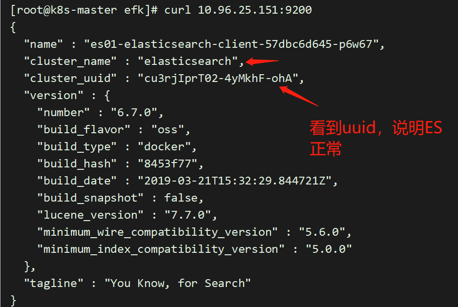

```shell
#ES还有一种访问方式，能看到他确切的状态
[root@k8s-master efk]# curl 10.96.25.151:9200/_cluster/health?pretty
```

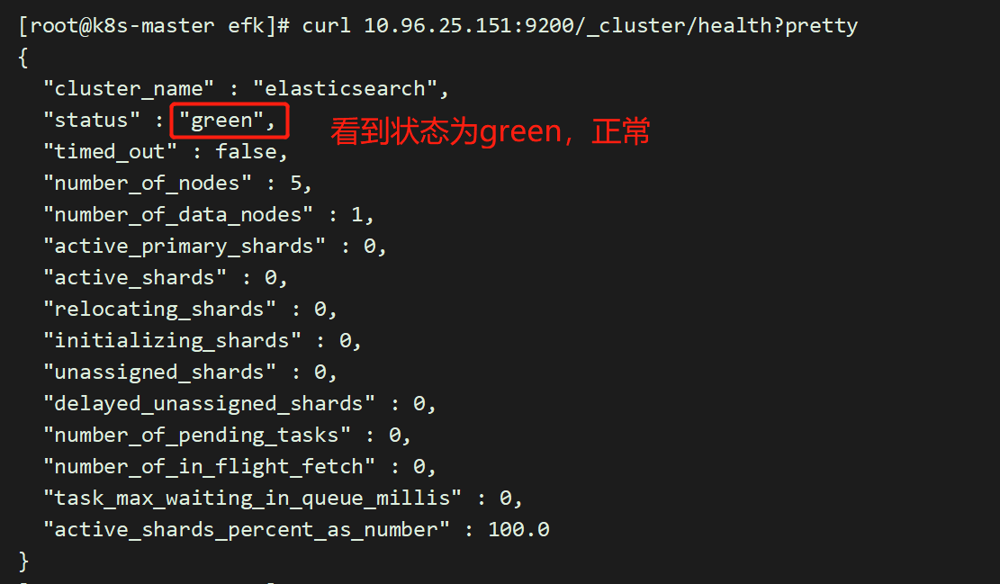

至此，Elasticsearch部署完毕

## 6.Elasticsearch-client域名获取

这一步，只是测试一下，是否能通过域名来访问到es，不用域名的话，就用ip也可以的

根据es01-elasticsearch-client的svc信息获取到es01-elasticsearch-client的域名；用于后面的fluentd 和kibana。

启动一个pod

```shell
[root@k8s-master test]# pwd
/root/k8s_practice/test
[root@k8s-master test]# cat myapp_demo.yaml 
apiVersion: v1
kind: Pod
metadata:
  name: myapp-demo
  namespace: efk
  labels:
    k8s-app: myapp
spec:
  containers:
  - name: myapp
    image: daocloud.io/library/nginx:1.12.0-alpine #这个镜像中有nslookup命令即可，来检测域名
    imagePullPolicy: IfNotPresent
    ports:
    - name: httpd
      containerPort: 80
      protocol: TCP
```

daocloud.io/library/nginx:1.12.0-alpine 这个镜像我是在daocloud上找的；

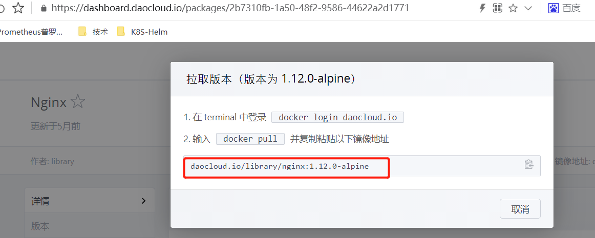

```
[root@k8s-master test]# kubectl apply -f myapp_demo.yaml
[root@k8s-master test]# kubectl get pod -n efk
```

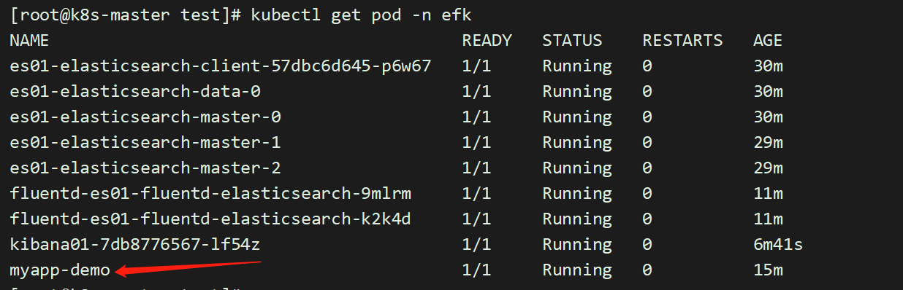

```
# 查看出es的service的ip，
[root@k8s-master test]# kubectl get svc -n efk
```

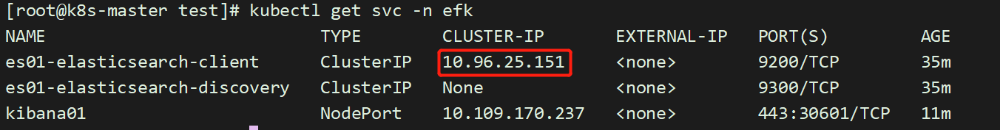

```
# 查出来它固定的域名
[root@k8s-master test]# kubectl exec -it myapp-demo sh -n efk
/ # nslookup 10.96.25.151
```

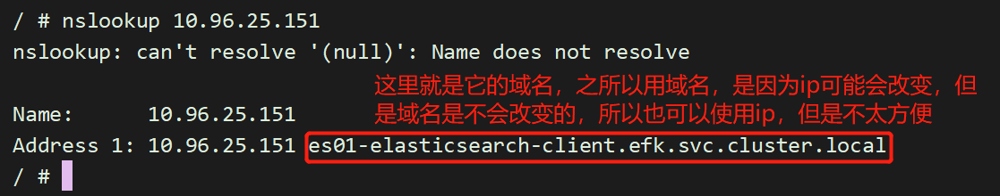

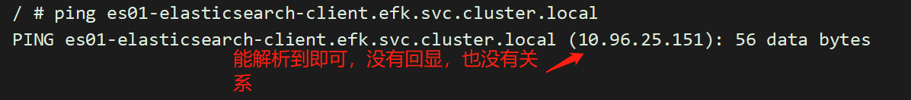

这样就找出了es固定的域名，所以这一步，只是这样的目的；

## 7.Fluentd获取

chart下载与配置修改

```
[root@k8s-master efk]# pwd
/root/k8s_practice/efk
[root@k8s-master efk]# helm search repo stable/fluentd-elasticsearch
```

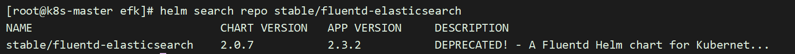

```
# 获取fluentd-elasticsearch 并解压
[root@k8s-master efk]# helm fetch stable/fluentd-elasticsearch --version 2.0.7
#如果下载失败，多下载几次就行
```

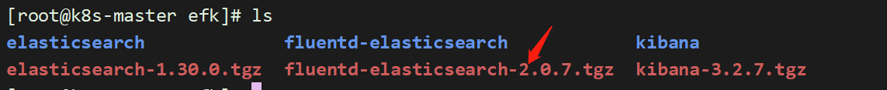

```
[root@k8s-master efk]# tar xf fluentd-elasticsearch-2.0.7.tgz
```

```
# 修改配置文件
[root@k8s-master efk]# vim fluentd-elasticsearch/values.yaml
### 为什么使用域名而不是IP，因此每次重启ES的svc，对应IP都会改变。而域名是不变的
elasticsearch:
  host: 'es01-elasticsearch-client.efk.svc.cluster.local'   # 修改处，域名获取参见上文
  port: 9200
  scheme: 'http'
```

## 8.fluentd-elasticsearch部署

```
[root@k8s-master efk]# pwd
/root/k8s_practice/efk
[root@k8s-master efk]# helm install fluentd-es01 --namespace=efk fluentd-elasticsearch
# 状态查看
[root@k8s-master efk]# helm list -n efk
```

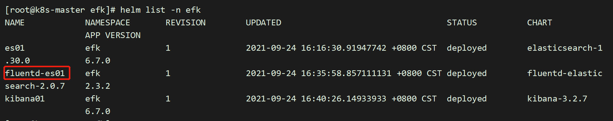

```
[root@k8s-master efk]# kubectl get pod -n efk
```

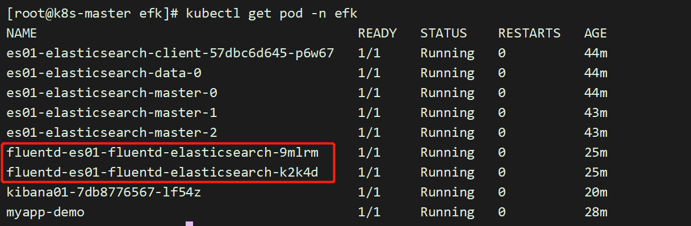

## 9.Kibana获取

kibana的主版本和大版本必须和elasticsearch（ES）一致，小版本可以不同；但两者版本最好一致，这样可以避免一些因版本不同导致的意外情况。

由于elasticsearch（ES）使用的是6.7.0，因此kibana我们也是用该版本。

chart下载与配置修改

```
[root@k8s-master efk]# pwd
/root/k8s_practice/efk
#查看所有版本
[root@k8s-master efk]# helm search repo stable/kibana
```

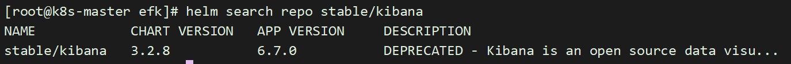

```
# 获取kibana，并解压缩
[root@k8s-master efk]# helm fetch stable/kibana --version 3.2.7
# 获取失败，就多获取几次
```

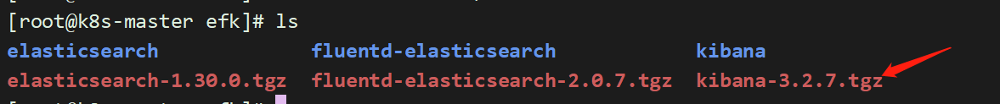

```shell
[root@k8s-master efk]# tar xf kibana-3.2.7.tgz 
```

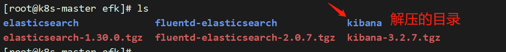

```shell
[root@k8s-master efk]# vim kibana/values.yaml
### 为什么使用域名而不是IP，因此每次重启ES的svc，对应IP都会改变。而域名是不变的
files:
  kibana.yml:
    ## Default Kibana configuration from kibana-docker.
    server.name: kibana
    server.host: "0"
    elasticsearch.url: http://es01-elasticsearch-client.efk.svc.cluster.local:9200   # 修改处，域名获取参见上文
===================================
service:
  type: NodePort  # 修改内容  从ClusterIP改为NodePort
  externalPort: 443
  internalPort: 5601
  nodePort: 30601  # 添加处，Service端口范围：30000-32767


# 配置修改2
[root@k8s-master efk]# vim kibana/templates/deployment.yaml 
apiVersion: apps/v1   # 从 apps/v1beta1 改为 apps/v1
kind: Deployment
metadata:
==================================
spec:
  replicas: {{ .Values.replicaCount }}
  revisionHistoryLimit: {{ .Values.revisionHistoryLimit }}
  # 添加信息 如下
  selector:
    matchLabels:
      app: {{ template "kibana.name" . }}
      release: "{{ .Release.Name }}"
  # 添加信息 如上
```

## 10.kibana部署

```
# 部署kibana-oss
# 当前目录
[root@k8s-master efk]# pwd
/root/k8s_practice/efk
# 部署kibana-oss
[root@k8s-master efk]# helm install kibana01 --namespace=efk kibana

# 状态查看
[root@k8s-master efk]# helm list -n efk
```

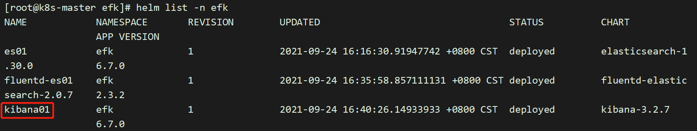

```shell
[root@k8s-master efk]# kubectl get deploy -n efk
NAME                        READY   UP-TO-DATE   AVAILABLE   AGE
es01-elasticsearch-client   1/1     1            1           52m
kibana01                    1/1     1            1           28m
```

```
[root@k8s-master efk]# kubectl get pod -n efk
```

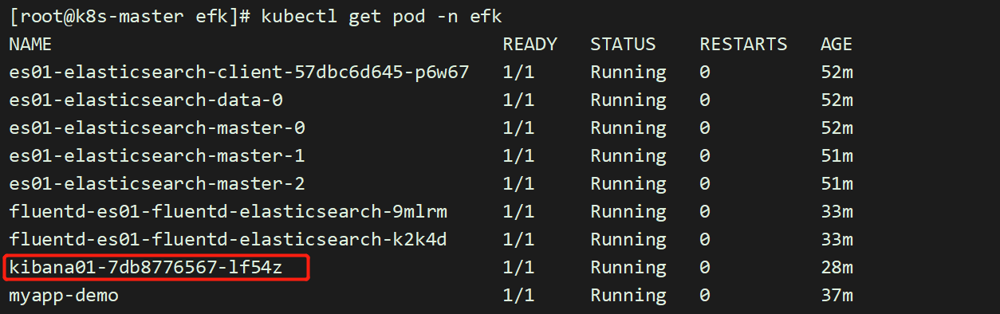

```shell
# 查看svc信息
[root@k8s-master efk]# kubectl get svc -n efk -o wide
```

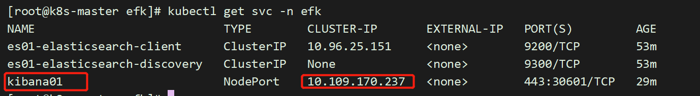

## 11.浏览器访问

```shell
[root@k8s-master efk]# kubectl get pod -n efk -o wide
```

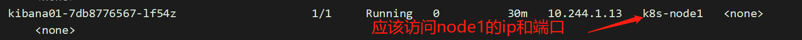

http://192.168.153.147:30601

下面就是创建索引了，这里要知道fluentd收集到的日志，会输送到ES中，定义的索引名字，我们要知道

```
# 肯定是在fluentd的配置文件中定义的，不要急，打开慢慢找
[root@k8s-master efk]# vim fluentd-elasticsearch/values.yaml
```

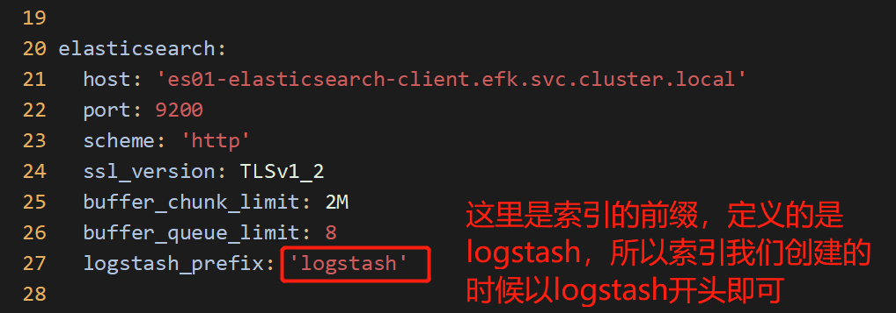

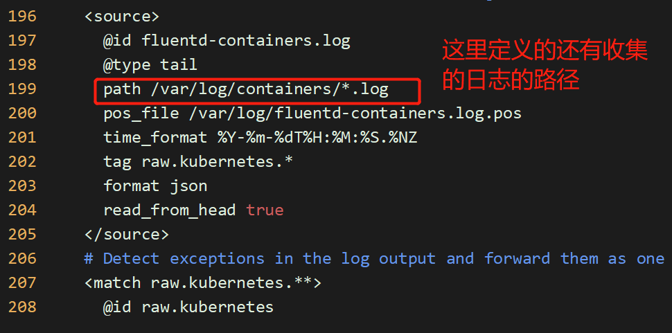

所以，能看懂，以后会改就行！！

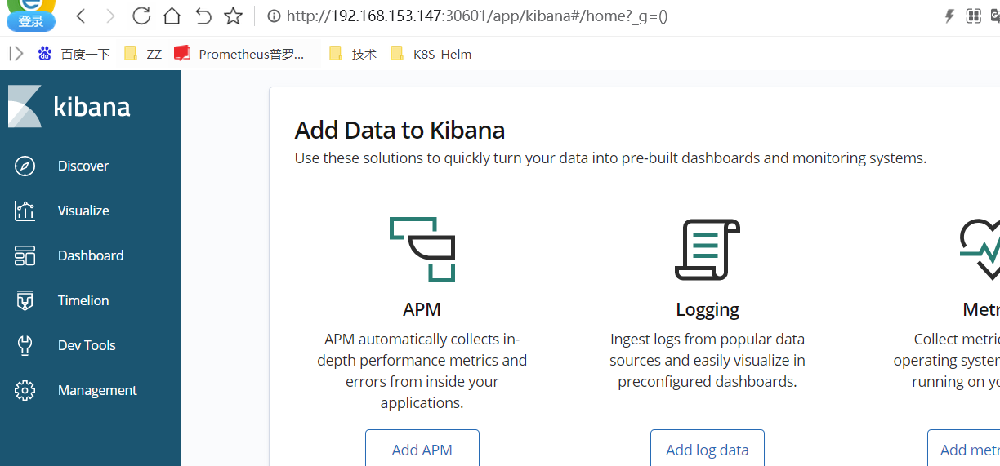

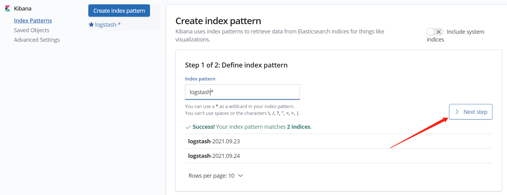

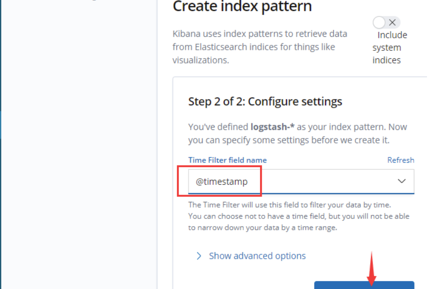

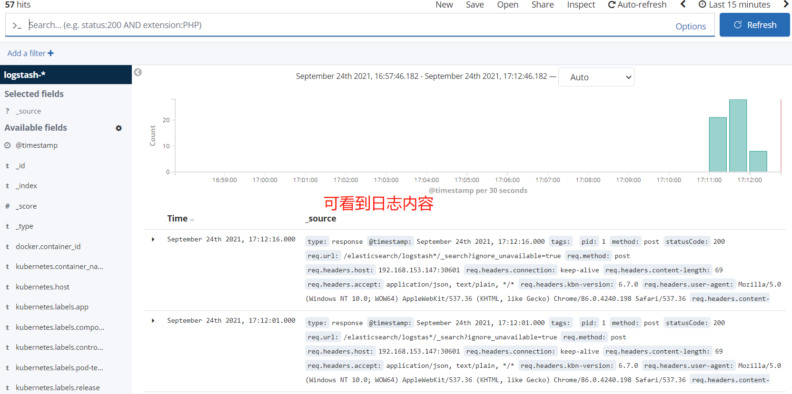

大功告成！！！！

