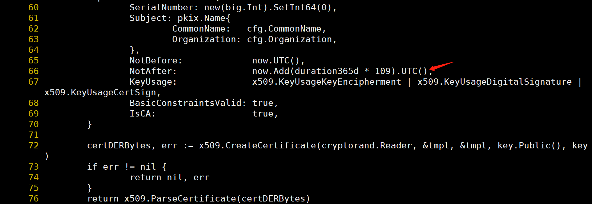
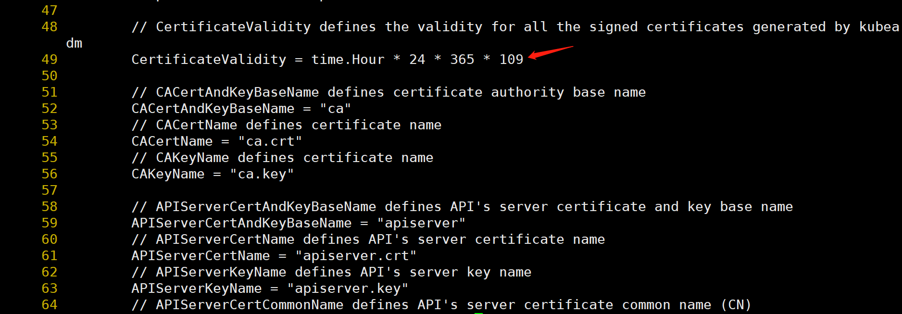
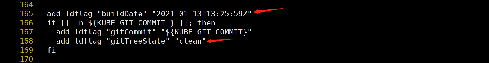

### kubernetes更新证书
```javascript
sha256sum /root/kubeadm
/root/kubespray/roles/download/defaults/main.yml  #更改main.yml里面kubeadm的sha256sum值.
vi kubespray/roles/download/defaults/main.yml
download_run_once: true  #只下载一次镜像，其它的机器同步.
cat /root/kubespray/inventory/mycluster/group_vars/all/all.yml | grep http_proxy
http_proxy: "socks5://172.27.0.6:1080" #使用代理.
```

### kubeadm编译好的版本sha256sum
```javascript
a85c3d93c3d4820e38e631310d3a34b0b30b596b77b54857a5d96de048795707 kubeadm-v1.23.1-amd64
```


```javascript
cd /root && wget https://github.com/kubernetes/kubernetes/archive/v1.19.7.tar.gz && tar zxvf v1.19.7.tar.gz
kubectl get pod -A | grep Terminated | awk '{print "kubectl delete pod " $2 " -n" $1}'|bash #批量删除
cat docker-images.txt | xargs -I{} -n 1 -P 10 docker pull {}
kubectl get pod -A | grep -P 'kube-system|rook-ceph' #过滤.
cd kubernetes-1.19.7
```

### 修改CA文件为100年

```javascript
cd kubernetes-1.19.7 && vi ./staging/src/k8s.io/client-go/util/cert/cert.go
```



### 修改证书为100年

```javascript
vi ./cmd/kubeadm/app/constants/constants.go
```



### 修改GitTreeState版本信息

```javascript
vi hack/lib/version.sh
```



### 检查kube-cross版本

```javascript
#pull 镜像
cat /root/kubernetes-1.19.7/build/build-image/cross/VERSION
docker pull us.gcr.io/k8s-artifacts-prod/build-image/kube-cross:v1.15.5-1

#启动容器
docker run --rm -v /root/kubernetes-1.19.7:/go/src/k8s.io/kubernetes -it us.gcr.io/k8s-artifacts-prod/build-image/kube-cross:v1.15.5-1 bash

#进入目录
cd /go/src/k8s.io/kubernetes
#编译
make all WHAT=cmd/kubeadm GOFLAGS=-v
#退出容器
exit
```


### 备份本地kubeadm.

```javascript
whereis kubeadm
mv /usr/local/bin/kubeadm /usr/local/bin/kubeadm_bak
cd /root/kubernetes-1.19.7
cp _output/local/bin/linux/amd64/kubeadm /usr/local/bin/kubeadm
```

### 检查证书

```javascript
kubeadm certs check-expiration
```
